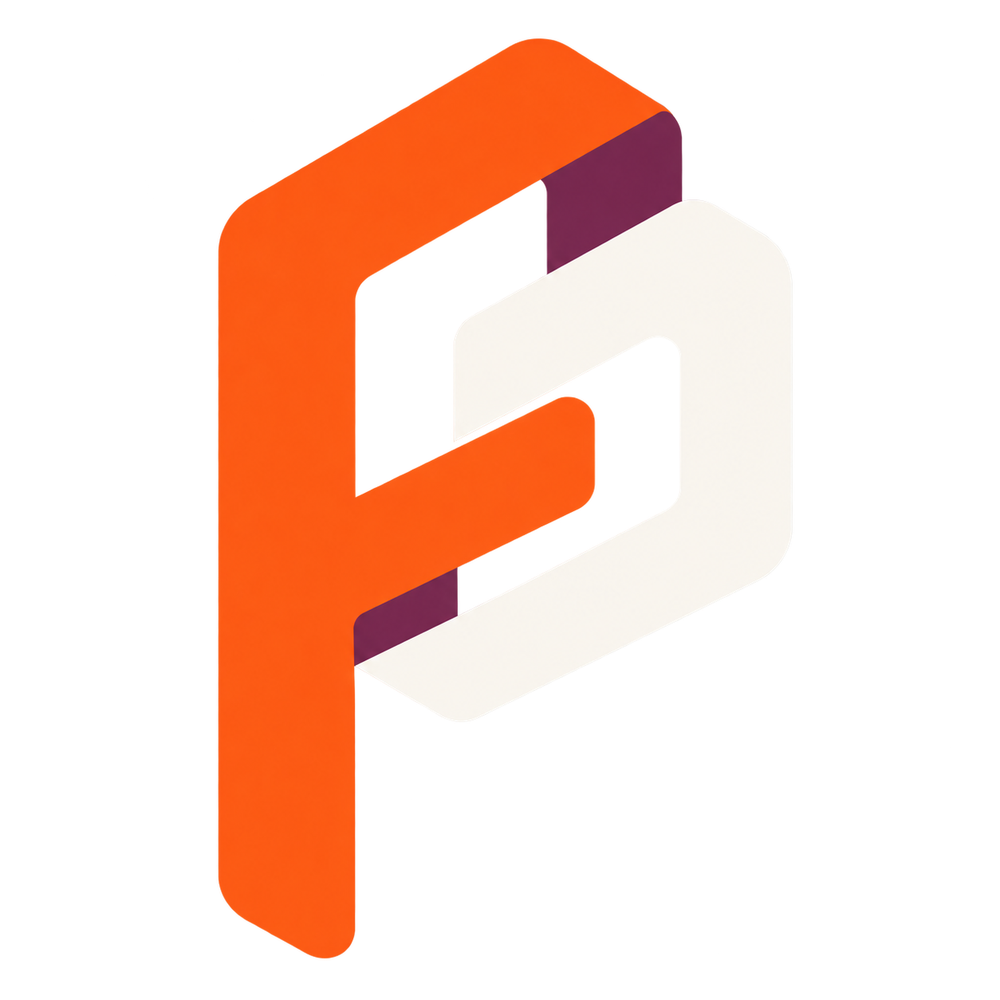
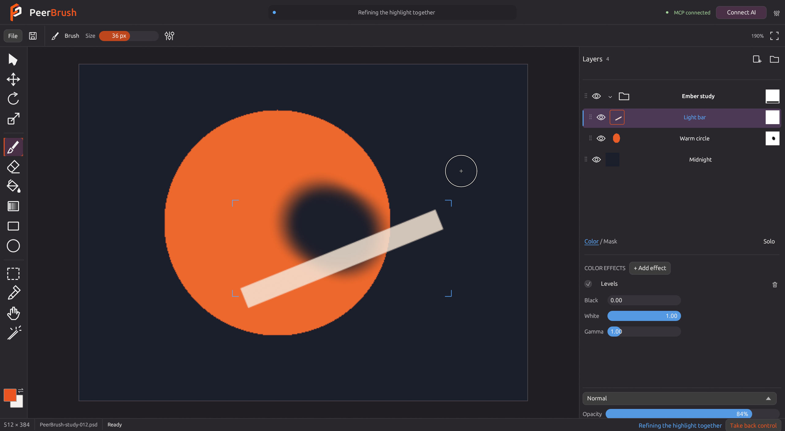

<div align="center">



# PeerBrush

### You and your AI. Same canvas.

**An image editor where humans and AI agents work in the same editable project.**

[](https://github.com/Deftr0y/PeerBrush/actions/workflows/ci.yml)
[](LICENSE)
[](Cargo.toml)
[](docs/mcp.md)

[Download Windows](https://github.com/Deftr0y/PeerBrush/releases/download/v0.1.4/PeerBrush-Windows.zip) · [Get started](docs/getting-started.md) · [Connect your AI](docs/mcp.md) · [Development](docs/development.md) · [Roadmap](FOLLOWUPS.MD)

</div>

PeerBrush is an image editing application designed from the ground up for humans and AI agents to work on the same project together.

Instead of treating AI as a separate prompt box, PeerBrush gives both the user and the agent access to the actual editing environment, including layers, selections, masks, transforms, brushes, effects, and document state.

The goal is simple: **Make AI a participant in the creative workflow, not just a generator.**



*Actual native workspace. Ember orange identifies human interaction; blue identifies AI work.*

## A shared creative workspace

Most AI image workflows are built around **Prompt → Generate → Result**. PeerBrush is built around **Human + AI → Shared Project**.

You stay in control while AI works directly alongside you inside the same editing environment. Both participants use the current document state, the same editing commands, and visible, editable, reversible changes.

| Create and edit | Work with AI | Keep control |
| --- | --- | --- |
| Paint, erase, fill, shapes, lassos, wand and soft selections | MCP and CLI access to the live document | Shared undo/redo with participant checks |
| Layer and folder hierarchy, multi-selection | Actual PNG views with pixel coordinates | Atomic edits and conflicting-revision checks |
| Separate editable color and mask effect stacks | Place generated images into exact regions | Optional layer/region reservations and takeover |
| Color balance, hue, curves, bloom and editable liquify | Blue activity markers and animated changes | PSD working files and PNG export |

### Built for the way you work

- **Progressive document loading.** Cancellable native16 PSD decoding, saved-image feedback and bounded disposable effect caches. See [large-document behavior](docs/large-documents.md).
- **Visual, compact controls.** White tool glyphs, Ubuntu Sans, uncluttered range values and live canvas feedback.
- **Compact transform modes.** Q/W/E/R sit at the bottom right, with the same shortcuts, live rendered gizmos and blue AI feedback.
- **A browsable brush library.** Twenty-one original procedural presets, six categories, search and readable stroke previews. Edit pressure response, texture, taper and flow, then save custom brushes; the UI and agents use the same native-depth painting engine.
- **A useful hierarchy.** Distinct folders, multi-layer editing, drag into or out of folders, animated reorder previews, visibility sweep gestures, inline renaming, grouping and merging.
- **Editable effects.** Compact color and mask stacks have recognizable icons and an always-visible Weight for every effect. Select a row to open its settings; top effects run last. Parameter drags preview through the shared engine and commit once on release. Blend and opacity sit beneath the stack.
- **Editable text and vectors.** Plain text with bundled font weights, multiline alignment, rectangles, ellipses and editable path points; native fill/stroke colors, live property previews and retained source placement. PSD files also contain current standard raster layers. See [supported source behavior](docs/editable-sources.md).
- **Retained transform originals.** Whole-layer rotation/scaling sample original native artwork and painted masks across gestures and PSD reopening; later pixel edits establish a fresh baseline for the changed source. See [transform behavior](docs/retained-transforms.md).
- **Familiar navigation.** Maya-style W/E/R gizmos, Q to hide, F to frame, middle drag to pan, wheel or Alt + right drag to zoom.
- **A painting brush.** Round, dry, chalk, grain and bristle tips; size and opacity pressure, start/end taper, flow, spacing and smoothing. Wet blending carries pigment along the stroke. Live size changes, Alt eyedropper, two colors and X to swap.
- **Native 16-bit precision.** Open supported 16-bit RGB PSD layers, retain channel precision through edits and history, and save PSD or PNG at the same depth. Unsupported Photoshop structures stay protected, with an explicit copy that flattens structure while keeping 16-bit samples.
- **Color that stays editable.** Warm highlights and cool shadows independently, shift hue/saturation, add threshold-controlled bloom, and brush an editable liquify warp. Clipped adjustments target one layer; a shared adjustment can affect selected artwork inside a folder.
- **More blend choices.** Linear dodge / Add, dodge/burn, soft/hard light, difference, exclusion, subtract and divide, with hover previews.
- **Real clipboard support.** Copy, cut, paste or duplicate whole layers and folders, including masks and effects; copy selected pixels or the composite; accept images copied in other applications.

## Run PeerBrush

[Download the Windows x64 portable build](https://github.com/Deftr0y/PeerBrush/releases/download/v0.1.4/PeerBrush-Windows.zip), extract it, and run `PeerBrush-Windows/peerbrush.exe`. **No Rust installation is needed to use it.** Open/import/drop an image, work in layers, save PSD, and export PNG.

To develop from source:

```sh
cargo run
```

```sh
cargo test --locked
cargo build --release --locked
```

Windows, macOS and Linux builds are configured in CI. This checkpoint has been tested on Windows; other platforms still require successful CI and native desktop verification. See [getting started](docs/getting-started.md) and [platform development notes](docs/development.md).

## Connect an AI agent

Click **Connect AI** to register PeerBrush with detected Codex, Claude Desktop, Cursor and Gemini CLI installations. Existing client settings are preserved and backed up. A local discovery manifest gives other agents the executable, workspace and authenticated HTTP endpoint. Restart or reload a configured client to load the tools; the top bar turns green when it actually connects.

The adapter can initialize while the editor is closed, then reconnect when you open it. Advanced settings and manual setup are available beside Connect AI. See [connection details](docs/mcp.md).

Agents can observe a layer, mask, or cropped canvas region; edit through shared commands; place generated or edited pixels; and undo, inspect, refine, or redo an attempt. Model choice stays outside PeerBrush, so different compatible models and agents can plug into the same workflow.

```json
{
  "path": "C:/art/generated.png",
  "rect": [100, 80, 500, 380],
  "layer": "CONTEXT_LAYER_OR_FOLDER_ID",
  "new_layer": true,
  "name": "Generated detail",
  "actor": "my-agent",
  "expected_revision": 7
}
```

*Arguments for `peerbrush_place_image`. Placement is undoable and returns the layer ID plus cropped PNG feedback. Set `new_layer:false` and `mode:"replace"` for an edited patch on an existing layer.*

See [MCP and CLI](docs/mcp.md) for setup, tools, reservations, coordinate conventions and artistic iteration.

## Core idea

PeerBrush is built around a shared creative workspace where:

- You can edit manually at any time
- AI agents can inspect and modify the same project
- Both sides work with the current document state
- Changes remain visible, editable, and reversible
- Tools can be used through the interface or programmatically
- Different AI models and agents can plug into the same workflow

## Vision and planned features

The long-term goal is an MCP-native creative application where compatible AI agents inspect, understand, and manipulate the same project the user is actively editing.

- Layer-based image editing
- Masks and selections
- Transform and drawing tools
- Non-destructive editing where possible
- Shared document state
- MCP support and agent-accessible editing tools
- Local and remote model support through connected agents
- Extensible tool and plugin architecture

Development now includes retained regional previews, tiled GPU previews, folder transforms, selective agent-task undo, richer edge refinement, optional local learned subject/object selection, native clone/heal, crop/canvas/image resizing, editable text/vector sources, transforms that retain original pixels, progressive loading, optional AI proposals, stronger raster PSD fidelity and compact weighted effects stacks. The next slices cover the brush library, transform controls and project lifecycle. The living [FOLLOWUPS.MD](FOLLOWUPS.MD) records requests and their status; [learned-selection setup](docs/segmentation.md) keeps model choice outside the editor, and [AI collaboration](docs/collaboration.md) describes optional review.

## Status

🚧 **Early development — [v0.1.4 checkpoint](docs/checkpoint-0.1.4.md)**

PeerBrush is currently experimental and under active development. Features, APIs, and project structure are expected to change.

Editable PSD support currently targets **PSD v1, 8-bit and 16-bit RGB**, basic raster layers, isolated and pass-through groups, supported blend modes, raster masks and default grouped raster clipping stacks. Supported clipping and raster-only pass-through folders stay layered in standard PSD data. PeerBrush preserves editable effect sources in private metadata and writes current standard raster/mask data and a merged composite. Embedded RGB matrix ICC profiles display through sRGB and support an explicit editable sRGB copy at the original depth. Protected-original PNG export keeps native samples and its ICC tag; converted PSD/PNG copies carry an sRGB tag. Unsupported Photoshop features and profiles open as a read-only merged preview at the original depth. Full Photoshop compatibility, PSB and full color management remain future work. See [supported Photoshop behavior](docs/photoshop-fidelity.md).

The shell uses Rust, egui/eframe and wgpu. Sparse copy-on-write tiles share unchanged image data with history. Incremental strokes reuse coverage and composite affected regions, then upload only changed preview pixels. Larger previews use bounded parallel CPU rendering. Common expensive 8-bit effects use optional GPU compute with a measured CPU fallback; native 16-bit sources retain their precision through the renderer. Full tiled GPU compositing remains on the roadmap.

## License

GNU General Public License v3. See [LICENSE](LICENSE). Bundled fonts and dependencies retain their own licenses; portable packages include source and third-party notices.


The local Windows 0.1.4 build adds the selection toolbar and Select menu (Ctrl+D deselects, Ctrl+Shift+D reselects, Ctrl+J duplicates layers), on-canvas editable Liquify, visual Levels and smooth Curves controls, one Add Mask action, connected Color/Mask buttons, generated tool artwork and wordmark, precise AI reservations with blue AI tags, and right-click canvas dimensions/depth settings. The download link above remains the separately published release. See [getting started](docs/getting-started.md) for behavior and selection limits.
