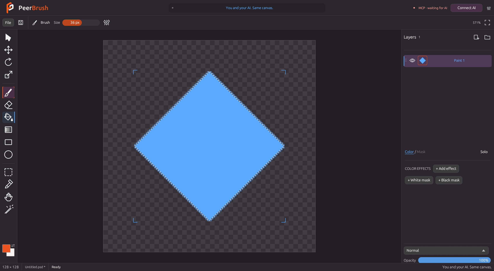

# PeerBrush v0.1.2 checkpoint

This checkpoint makes the shared editing environment easier to connect to and improves everyday layer workflows. Regular layers and folders are the creation choices. The provisional interlocking P logo follows MayaMCP's orange, ivory and plum mark.

## Layer workflow

- Color / Mask is one compact connected selector. Blend mode and opacity stay beneath the effects, with Add effect accessible above the scrollable stack.
- The top effect runs last in both color and mask stacks. Saved execution order is preserved; reorder buttons follow the visible order.
- Double-click renames a layer or folder directly in its row. Enter or clicking away commits; Escape cancels. Ctrl-click multi-selection remains independent of renaming.
- Ctrl/Cmd+D duplicates selected layers or folders. Whole-layer Ctrl/Cmd+C/X/V preserves descendants, masks, effects, positions and editable sources using copy-on-write snapshots. Text fields and pixel copying retain their normal behavior.
- New folders gather selected roots in visible order, with atomic lock, reservation and nesting checks.
- Ctrl/Cmd+E or Merge bakes adjacent normal-blend siblings, or a selected folder, into one undoable raster layer. Unsupported merges are rejected before changing the document. Single merge rendering occurs outside the shared engine lock and requires an unchanged document before commit.

## Selection and fill

Alt+Backspace floods with the foreground color. A selection clips the fill; without one, the visible canvas is filled on the active layer. Existing offset rasters expand as needed, preserving surrounding pixels, masks and effects. Alt+B remains available. Legacy fill sources retain their appearance and become regular raster content when a fill edit requires materializing them.

Selection outlines rotate, move and scale with the pixels. Polygon geometry is shared by the UI, engine and agents; brush strokes, erasing, fills, shapes, gradients and copied pixels respect its exact shape. Multiple selected layers share the original selection and its pivot during one gesture. Undo/redo and PeerBrush PSD metadata preserve geometry.

## AI connection

Connect AI registers detected Codex, Claude Desktop, Cursor and Gemini CLI clients with the running executable and exact workspace. It preserves unrelated settings and comments, writes backups, and publishes a token-free local discovery manifest. Advanced/manual setup is available beside the button. Reload or restart configured clients; the green indicator requires an actual attached client.

Authenticated loopback Streamable HTTP supports MCP 2026-07-28, 2025-11-25 and 2025-06-18, with modern discovery and legacy sessions/notifications. The stdio adapter retains offline initialization, heartbeat, reconnection and EOF cleanup. Remote/cloud clients require an external bridge; this release does not publish a public endpoint or start a model.

## Validation

- 148 automated tests passed on Windows. One OS-clipboard fixture is intentionally excluded from unattended runs; fake-provider tests cover failed writes, stale cuts, typed layer markers and external-image fallback without changing the user's clipboard.
- Real egui pointer/key tests cover inline rename, Ctrl-click selection, layer clipboard intent, Ctrl+D, Alt+Backspace, automatic folders, selection-centered rotation and the fixed effects footer.
- HTTP MCP tests cover supported versions, legacy sessions and empty notifications, modern discovery, host/origin/authentication checks, bounded sessions, actual image placement and PNG feedback. Stdio tests cover offline catalogs, reconnection, heartbeat and EOF cleanup.
- The native Windows executable passed rotated selection and exact fill, layer duplication/grouping/merging/undo, shared MCP/CLI state and cropped PNG feedback checks.
- Independent psd-tools reading confirmed exact standard merged alpha and premultiplied color within two channel values for the native transparent selection study.
- Actual workspace, brush and editable HEX picker screenshots were visually checked. The selection outline follows the rotated diamond, and Color / Mask plus bottom blend/opacity are visible in the native workspace.
- Release compilation and formatting completed successfully. Local Clippy is unavailable; CI includes Clippy and Windows/macOS/Linux build jobs.

## Remaining scope

Liquify, subject/object segmentation, full folder transforms, selective task undo, text/vector sources, broader PSD fidelity, color management, incremental/GPU compositing and further logo refinement remain planned. The portable release is Windows x64; native macOS/Linux validation awaits CI and platform checks.

