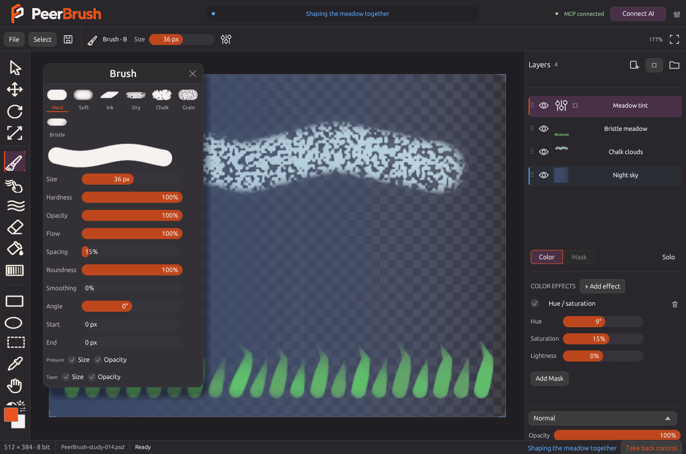

# PeerBrush 0.1.3 candidate — Native 16-bit painting

These are historical validation notes for an unpublished candidate. The published successor is [v0.1.4](checkpoint-0.1.4.md), which also includes the reconciled selection changes and a fresh verification of the final source. Measurements below belong to the earlier candidate.

PeerBrush now supports textured and tapered painting, wet blending, editable liquify, clipped adjustments, color balance, HSL, bloom and additional blend modes including Linear dodge / Add. The UI, MCP and CLI use the same reversible document operations and actual canvas previews.

## Painting and effects

- Dry, chalk, grain and bristle brush tips have repeatable texture controls. Size/opacity pressure uses real force when provided; start/end taper also works with mouse input.
- Wet blending carries existing pigment; load, wetness and pickup control the result. Brush and smudge previews match the committed edit.
- Color balance separates shadows, midtones and highlights. HSL changes hue, saturation and lightness. Bloom has threshold, spread and strength controls.
- Adjustment layers can clip to one paint layer or share changes across selected artwork in a scoped folder. Masks remain editable.
- Liquify retains push, expand, pinch and restore strokes in an editable effect. The actual pixels move while dragging; revisit amount or stroke strength later. Color liquify is supported; it does not silently act on color when a mask is selected.
- Layer/mask stacks, grouping, whole-layer clipboard, transforms, merge, visibility sweeps and undo keep their shared-engine checks.

### Photoshop file opening

PeerBrush now keeps authoritative 16-bit RGBA samples through editing and saving. Supported 16-bit RGB PSD layer records and masks load from Photoshop's `Lr16` data. Saves contain ordinary 16-bit layers, masks and a current merged composite, with editable PeerBrush sources in private format 5. Display previews are projected to 8-bit; the source pixels remain 16-bit. PNG export also retains the document's 16-bit depth.

Unsupported Photoshop features still open as protected saved-composite previews. The original Photoshop layers remain in the source file. For a 16-bit source, **Edit 16-bit copy** creates a new, untitled flattened project while retaining the original composite's 16-bit samples. It can be edited and saved under a new name; it does not restore unsupported Photoshop source features or layers. Creating the copy does not modify the original PSD. Choose an actual `.psd` file inside a folder when opening; dropping a folder gives a helpful message.

The 16-bit preview reader handles raw, RLE, ZIP and ZIP-predicted RGB composites with bounded decompression. A file without a saved compatibility composite gives an explicit error. PSB, unsupported color modes and full ICC color management remain outside this checkpoint; embedded profiles produce a warning.

Final native QA passed for all eleven original Hippo PSDs on the refreshed 0.1.3 executable in an isolated headless workspace. **Hippo_Egg.psd opens as three editable 16-bit raster layers.** Independent PSD tools read its standard channels without using PeerBrush's private data: all twelve RGBA source channels and ten benign Photoshop metadata blocks survived saving exactly. Its recomposed appearance stayed within three premultiplied 16-bit words and two alpha words of Photoshop's saved merged composite. The visible 8-bit premultiplied result stayed within one value. Comparing unassociated RGB near nearly transparent pixels gives larger differences because Photoshop rounds its saved white-matted composite; those differences do not indicate changes to the editable source channels.

The other ten Hippo PSDs contain unsupported Photoshop source features and remain protected. Their exported native samples and display previews matched an independent saved-composite reader exactly. Explicit editable copies retained the same native 16-bit samples while flattening the unsupported layer structure. Independent PSD tools confirmed that every saved standard RGBA layer-channel word matched those copies.

For all eleven files, standard 16-bit merged channels matched the expected white-matted samples exactly. Saving and reopening preserved every exported native word; a selected one-pixel fill and undo restored every word exactly. Each image retained between 510,873 and 1,996,016 channel samples that cannot be represented by an 8-bit value promoted to 16-bit. The original files' SHA-256 hashes stayed unchanged. Opening the Hippo folder returns the explicit instruction to choose a `.psd` file inside it.

## Performance

Portable packaging does not prevent acceleration. The native renderer uses wgpu; expensive supported effects can compute on the same GPU device. Brush coverage retains stroke data, effect-free canvas gestures composite only affected regions, and display textures receive partial uploads. Full CPU previews use a compiled layer tree and at most four workers. Source tiles and undo snapshots are copy-on-write.

Measured on the Windows release build with an NVIDIA GeForce RTX 3070 Ti Laptop GPU / Vulkan. Effect timings include upload, compute and readback; GPU numbers are median warm runs. They describe individual effects, not the whole editing latency.

| 2048 × 2048 effect | CPU | GPU | Precision check |
| --- | ---: | ---: | --- |
| 8-bit Gaussian blur, radius 32 | 1239 ms | 16 ms | Exact bytes |
| 8-bit bloom, spread 16 | 1594 ms | 39 ms | At most one byte |
| 16-bit HSL | 367 ms | 22 ms | At most 1/65535; alpha exact |
| 16-bit color balance | 626 ms | 24 ms | At most 1/65535; alpha exact |
| 16-bit adjustment | 171 ms | 25 ms | At most 1/65535; alpha exact |

Native 16-bit Gaussian blur and bloom use the full-precision CPU path. Cheap LUT effects remain on CPU when transfer overhead is slower. GPU failures/busy devices fall back without committing partial results; a test injects a failure after the first native tile completes and verifies every original source word is unchanged. The capability catalog reports the actual adapter, supported effects and dispatch status.

CPU stroke measurements were not finalized for this candidate. Full tiled GPU compositing, GPU brush/smudge/liquify and progressive large-document streaming remain follow-up work.

## Verification and limits

The final engine, codec, protocol and UI regression suite, three actual-device GPU checks, independent PNG16/PSD16 native checks and live workspace painting/MCP/CLI checks were run on Windows. Native screenshots above show the actual app. Original user PSDs and temporary QA/recovery files are excluded from source and packages.

The portable Windows ZIP includes the executable, full project source, GPL v3 license and dependency/font notices. Rust is required for source development; it is not required to run this build. macOS/Linux CI is configured, but native platform testing still remains. PSB, full ICC color management, editable Photoshop smart objects/text/vectors, pass-through group fidelity and wider Photoshop clipping compatibility remain outside this checkpoint.
